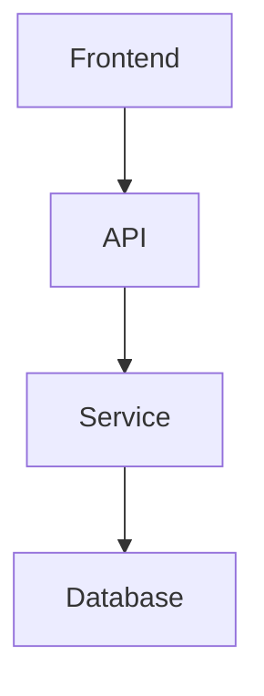
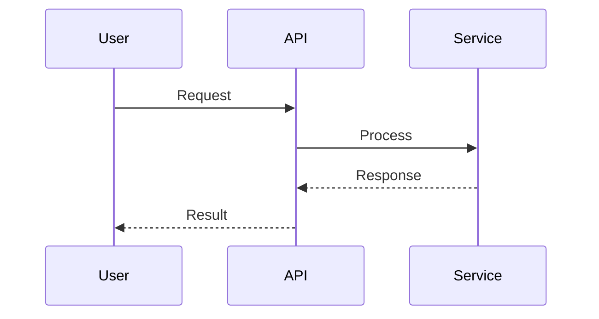

# Feature Documenter

Generate "Living Documentation" for a specific feature following the Vibe Coding schema.

**Usage:** `/doc $ARGUMENTS`

The `$ARGUMENTS` variable contains the feature name to document.

## Instructions

1. Read `/product_documentation/_manifest.json` (if exists) to understand existing documentation structure.

2. Scan relevant source files:
   - `app/api/routers/` - API endpoints
   - `app/workflows/` - Business logic
   - `app/core/` - Core utilities
   - `app/db/` or migrations - Database schemas

3. Generate a new file: `/product_documentation/[FEATURE]_DOC.md`

## Documentation Schema

Structure the documentation with these sections:

### 1. Product Overview
- Value proposition
- UI → API trace (user journey)

### 2. Success Metrics
| KPI | Description | Technical Source |
|-----|-------------|------------------|
| [Metric] | [Description] | `file.py:function_name` |

### 3. Edge Cases
List potential failure points:
- API rate limits
- Invalid user inputs
- Network latency
- External service failures

### 4. Technical Architecture
Data flow map using Mermaid.js syntax:

**Rule:** Split into multiple diagrams if > 8 nodes.

### 5. Data Models
| Table/Interface | Description | Location |
|-----------------|-------------|----------|
| [Name] | [Purpose] | `file.py` |

### 6. API Interface
| Endpoint | Method | Description |
|----------|--------|-------------|
| `/api/...` | GET/POST | [Description] |

### 7. Visuals
Mermaid.js sequence diagram for logic flow:

**Rule:** Split into multiple diagrams if > 8 nodes.

## Rules

- Always check `_manifest.json` first and update it with the new feature
- Use actual code references (file:line) not placeholders
- Keep diagrams focused and split if complex
- Include real endpoint paths and data structures from the codebase
