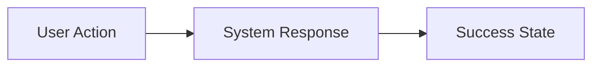

# EPIC-{ID}: {Epic Name}

## Metadata
| Field | Value |
|-------|-------|
| **Status** | Draft / Review / Approved / In Progress / Done |
| **Ambiguity Score** | 🔴 High / 🟡 Medium / 🟢 Low |
| **Context Source** | Roadmap / Codebase / User Input |
| **Owner** | {Name of PM/PO} |
| **Priority** | P0 - Critical / P1 - High / P2 - Medium |
| **Tags** | #frontend, #auth, #mobile, #payment |
| **Target Date** | {YYYY-MM-DD} |

---

## 1. The Executive Pitch
> Target Audience: Stakeholders, Business Sponsors, Non-Technical Leads

### 1.1 The Problem
Describe the pain point in 1-2 sentences. Why are we doing this?

### 1.2 The Solution
High-level description of what we are building.

### 1.3 The Value (North Star)
What is the measurable business win? (KPIs / OKRs)
- Increase conversion rate by X%
- Reduce support tickets by Y%
- Reduce time-to-value by Z minutes

---

## 2. The Scope Boundaries (AI Guardrails)
> Target Audience: Planner Agent (Critical for preventing hallucinations)

### 2.1 IN-SCOPE (Build This)
- [ ] Capability: {e.g. User enters email address}
- [ ] Capability: {e.g. System sends verification email}

### 2.2 OUT-OF-SCOPE (Do NOT Build This)
- No admin dashboard (handled in EPIC-004)
- No social login for this version
- No multi-language support yet

---

## 3. Context

### 3.1 User Personas
- **Persona A**: {Name} - {Role} - {Primary Goal}
- **Persona B**: {Name} - {Role} - {Primary Goal}

### 3.2 User Journey (Happy Path)

---

## 4. Dependencies

### 4.1 Technical Dependencies
- Database schema: {tables/collections required}
- External APIs: {third-party integrations}
- Shared components: {existing UI/logic to reuse}

### 4.2 Epic Dependencies
- Blocked by: [EPIC-{ID}](link)
- Blocks: [EPIC-{ID}](link)

---

## 5. Linked Stories
| Story ID | Name | Status |
|----------|------|--------|
| STORY-001 | {Story Name} | Draft |
| STORY-002 | {Story Name} | Draft |
