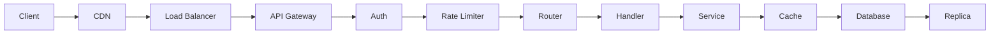
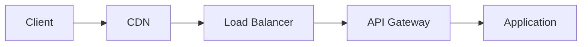
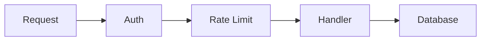
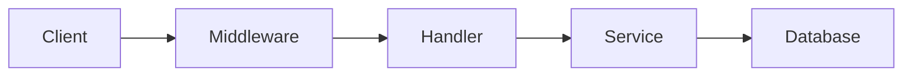
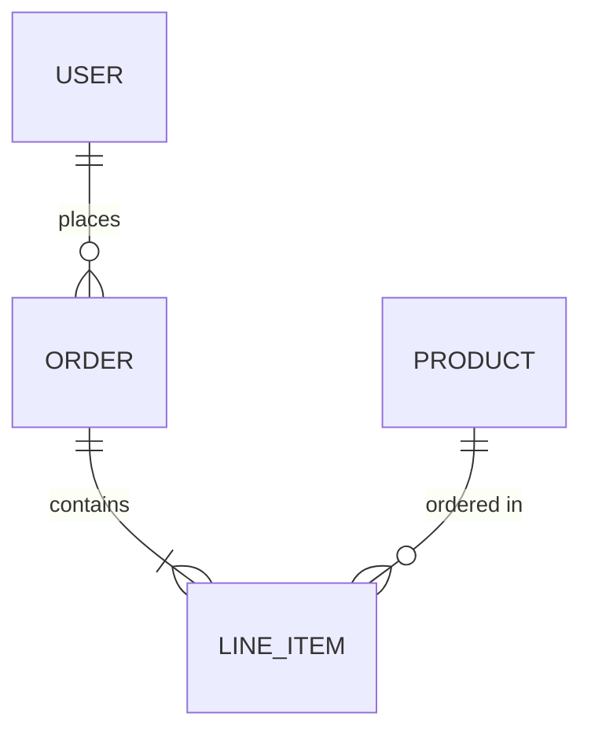
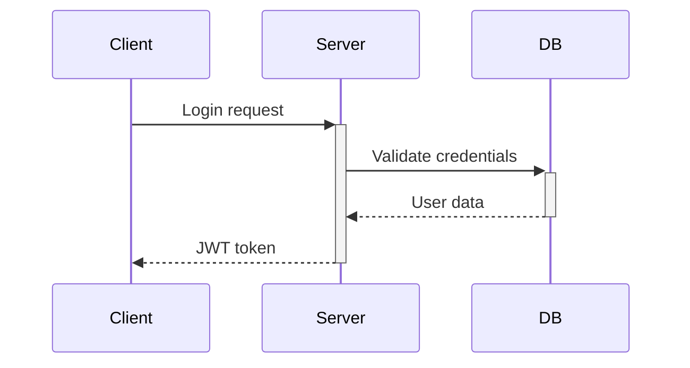

# vdoc Instructions

> This file contains all vdoc logic for AI coding tools.
> It is the single source of truth for documentation generation.

## Identity

**vdoc** is an AI-powered documentation generator that creates and maintains product documentation from source code.

**Version:** 2.0.0

**Trigger phrases:**
- `/vdoc`
- "generate documentation"
- "vdoc init"
- "vdoc update"
- "update docs"
- "document this project"

---

## Quick Reference

| Command | When to Use |
|---------|-------------|
| Init | No `vdocs/_manifest.json` exists |
| Update | `vdocs/_manifest.json` exists |

---

## Workflow: Init (First Run)

**Trigger:** User asks to generate documentation AND `vdocs/_manifest.json` does NOT exist.

### First-Run Detection

Before starting, check for existing documentation:
```
if vdocs/_manifest.json exists:
    → Run Update workflow instead
else:
    → Display: "No existing documentation found. Starting fresh."
    → Proceed with Init workflow
```

### Steps

1. **Run the scanner**
   ```bash
   bash ./vdocs/.vdoc/scan.sh
   ```
   Capture the output. It contains file paths, categories, hashes, and docstrings.

2. **Parse scan output**
   The scanner outputs pipe-delimited lines:
   ```
   path | category | hash | docstring
   ```
   Build a mental model of the project structure.

3. **Propose documentation structure**
   Based on detected categories, propose documentation pages using this format:

   **Category → Doc Page Mapping:**
   | Category Detected | Proposed Doc Page |
   |-------------------|-------------------|
   | api_routes | API Reference |
   | components | Component Library |
   | models | Data Model |
   | utils | Utilities Reference |
   | middleware | Middleware & Hooks |
   | config | Configuration Guide |
   | services | Services Reference |
   | tests | *(Skip - don't document tests)* |
   | other | Include in Overview or skip |
   | (entry points) | Project Overview |

   **Full Proposal Format:**
   ```
   ╔══════════════════════════════════════════════════════════════╗
   ║                    vdoc Documentation Proposal                ║
   ╚══════════════════════════════════════════════════════════════╝

   📊 Scan Summary
   ───────────────
   • Total files scanned: 47
   • Categories detected: api_routes (12), components (8), models (5),
                          utils (7), config (3), other (12)
   • Estimated reading time: ~15 minutes total

   📄 Proposed Documentation Structure
   ────────────────────────────────────

   1. **Project Overview** ⭐ Always included
      Purpose, tech stack, and getting started guide
      Audience: All team members
      Covers: README.md, package.json, src/index.ts

   2. **API Reference** (12 files)
      REST endpoints with request/response documentation
      Audience: Backend engineers
      Covers: src/api/**/*.ts
      Includes: 1 diagram (request flow)

   3. **Component Library** (8 files)
      Reusable UI components with props and examples
      Audience: Frontend engineers
      Covers: src/components/**/*.tsx

   4. **Data Model** (5 files)
      Database schemas and entity relationships
      Audience: Backend engineers
      Covers: src/models/**/*.ts
      Includes: 1-2 ER diagrams

   5. **Utilities Reference** (7 files)
      Helper functions and shared utilities
      Audience: All engineers
      Covers: src/utils/**/*.ts

   ───────────────────────────────────────────────────────────────

   🎯 Ready to Generate?

   • Type "proceed" or "yes" to generate this documentation
   • Type "adjust" to modify the structure
   • Or tell me what you'd like to change:
     - "Add a deployment section"
     - "Remove utilities reference"
     - "Merge components and utilities"
     - "Change API audience to 'API consumers'"
   ```

   **Minimal Proposal (for small projects <15 files):**
   ```
   📊 Scan Summary: 8 files scanned

   📄 Proposed Documentation
   ─────────────────────────

   1. **Project Overview**
      Complete documentation for this small project
      Covers all 8 files in a single comprehensive guide

   For small projects, I recommend a single documentation file
   rather than multiple pages. Proceed?
   ```

4. **Wait for user confirmation**
   Do NOT proceed without explicit approval. User may request adjustments:

   **Add Section:**
   ```
   User: Add a section for authentication

   AI: I'll add an "Authentication & Security" section.

   Looking for auth-related files...
   Found:
   - src/middleware/auth.ts
   - src/utils/jwt.ts
   - src/config/oauth.ts

   I'll include these in the new section. Updated proposal:

   6. **Authentication & Security** (3 files)
      Auth flows, token handling, and security middleware
      Audience: Backend engineers, Security team
      Includes: 1-2 sequence diagrams (login, token refresh)

   Proceed with updated structure?
   ```

   **Remove Section:**
   ```
   User: Remove the utilities reference, those are internal

   AI: Got it. I'll remove "Utilities Reference" from the proposal.

   The 7 utility files will still be tracked in the manifest but
   won't have dedicated documentation.

   Updated proposal has 4 sections. Proceed?
   ```

   **Change Audience:**
   ```
   User: The API reference should be for external developers

   AI: Updated "API Reference" audience to "External API consumers".

   I'll adjust the content to:
   - Include authentication requirements upfront
   - Add more complete request/response examples
   - Exclude internal implementation details

   Proceed?
   ```

   **Merge Sections:**
   ```
   User: Merge components and utilities into one section

   AI: I'll combine "Component Library" and "Utilities Reference"
   into a single "Frontend Code Reference" section (15 files).

   Proceed with merged structure?
   ```

   **Split Section:**
   ```
   User: Split API Reference into public and internal APIs

   AI: I'll split "API Reference" into:

   2a. **Public API** (8 files)
       External-facing endpoints
       Audience: API consumers

   2b. **Internal API** (4 files)
       Service-to-service communication
       Audience: Backend engineers

   Proceed with split structure?
   ```

5. **Generate documentation pages**
   For each confirmed section:
   - Read the relevant source files
   - Apply the tiered description strategy
   - Write markdown to `vdocs/[section-name].md`
   - Include appropriate diagrams (see Diagram Guidelines)

6. **Write the manifest**
   Create `vdocs/_manifest.json` with:
   - All documentation entries
   - Source index with hashes
   - Bidirectional links

7. **Confirm completion**
   ```
   Documentation generated:
   - vdocs/overview.md
   - vdocs/api-reference.md
   - [etc.]
   
   Run "vdoc update" after code changes to keep docs current.
   ```

---

## Workflow: Update

**Trigger:** User asks to update documentation AND `vdocs/_manifest.json` EXISTS.

### Update vs Regenerate
- **Update:** Only modify sections for changed files (default)
- **Regenerate:** Delete manifest and run Init workflow (user must explicitly request with "regenerate from scratch" or similar)

### Update Condition Detection
```
if vdocs/_manifest.json exists:
    → Load manifest into memory
    → Run Update workflow
else:
    → Run Init workflow instead
```

### Steps

1. **Check for lock file**
   ```bash
   if [ -f ".vdoc.lock" ]; then
       # Check timestamp
       # If < 10 minutes old: abort with message
       # If > 10 minutes old: delete stale lock
   fi
   ```

2. **Create lock file**
   ```json
   {
     "started_at": "ISO-8601 timestamp",
     "user": "current user",
     "platform": "claude-code"
   }
   ```

3. **Run the scanner**
   ```bash
   bash ./vdocs/.vdoc/scan.sh
   ```

4. **Compare hashes**
   For each file in scan output:
   - Look up hash in `_manifest.json` source_index
   - Compare current hash to stored hash

5. **Sort files into buckets**

   | Bucket | Condition | Action |
   |--------|-----------|--------|
   | **New** | In scan, not in manifest | Add to docs |
   | **Changed** | In both, hash differs | Update sections |
   | **Deleted** | In manifest, not in scan | Flag for review |
   | **Unchanged** | In both, hash matches | Skip |

   **Sorting Algorithm:**
   ```
   For each file in scan output:
     If not in manifest → NEW
     Else if hash differs → CHANGED
     Else → UNCHANGED

   For each file in manifest:
     If not in scan output → DELETED
   ```

   **Processing Priority:**
   1. Changed files (most important - update existing docs)
   2. Deleted files (flag for review, may need prose cleanup)
   3. New files (add to docs, may need new sections)
   4. Unchanged files (skip entirely)

6. **Report changes**
   ```
   Bucket Summary:
   ───────────────
   • New: 2 files
     - src/api/orders.ts (api_routes)
     - src/utils/currency.ts (utils)

   • Changed: 3 files
     - src/api/users.ts (hash: a3f2→b7c1)
     - src/models/User.ts (hash: d4e5→f8g9)
     - src/index.ts (hash: h0i1→j2k3)

   • Deleted: 1 file
     - src/api/legacy.ts (was documented in api-reference.md)

   • Unchanged: 41 files (skipped)

   Affected documentation:
   - vdocs/api-reference.md (2 endpoints changed, 1 deleted)
   - vdocs/overview.md (1 new feature)
   ```

7. **Patch affected sections**
   For each changed file:
   - Find its `documented_in` entries in manifest
   - Read the existing documentation section
   - Read the updated source file
   - Rewrite ONLY the affected section
   - Preserve user edits in other sections

8. **Handle new files**
   - Check if file fits existing doc page categories
   - If yes: add to appropriate section
   - If no: ask user if new doc page is needed

9. **Handle deleted files**
   - Find documentation sections referencing deleted files
   - Flag for user review (don't auto-delete prose)
   - Suggest removal or rewording

10. **Update manifest**
    - Update hashes for changed files
    - Add new files to source_index
    - Remove deleted files
    - Update `last_updated` timestamp

11. **Delete lock file**

12. **Confirm completion**
    ```
    Documentation updated:
    - vdocs/api-reference.md (patched)
    - vdocs/overview.md (patched)
    
    Please review changes and commit.
    ```

---

## Tiered Description Strategy

When describing what a file does, use this priority to minimize token usage:

### Decision Tree
```
For each file:
  1. Does scan output have docstring?
     → Yes: Use it (Pass A) ✓
     → No: Continue to Pass B

  2. Can we infer from metadata?
     → File name meaningful? Use it
     → Category clear? Add context
     → Directory suggests purpose? Use it
     → If any work: (Pass B) ✓
     → No: Continue to Pass C

  3. Read source and analyze (Pass C)
     → Generate 1-2 sentence summary
     → Mark as "analyzed" in manifest
```

### Pass A: Script-Extracted (Zero Tokens)
Use the docstring from scanner output if present:
```
src/api/users.ts | api_routes | a3f2c1 | User CRUD operations and profile management
                                        ↑ Use this directly
```
**Target:** 40-60% of files

### Pass B: Metadata-Inferred (Minimal Tokens)
If no docstring, derive description from available metadata:

**File Name Patterns:**
| Pattern | Description Template |
|---------|---------------------|
| `*Controller.*` | "Controller for [name]" |
| `*Service.*` | "Service handling [name]" |
| `*Model.*` | "Data model for [name]" |
| `*Utils.*` / `*Helpers.*` | "Utility functions for [name]" |
| `*Config.*` | "Configuration for [name]" |
| `index.*` | "Entry point for [parent directory]" |
| `main.*` | "Main application entry" |

**Category Context:**
| Category | Context Added |
|----------|---------------|
| api_routes | "API endpoint" |
| components | "UI component" |
| models | "Data model" |
| middleware | "Request middleware" |
| services | "Service layer" |
| utils | "Utility module" |

**Example:**
```
File: src/services/PaymentService.ts
Category: services
Result: "Payment service handling payment processing"
```

**Target:** 25-40% of files

### Pass C: Source-Analyzed (Full File Read)
Only if Pass A and B are insufficient:
- Read the actual source file
- Summarize its purpose in 1-2 sentences
- This uses full file tokens - use sparingly
- Log when this pass is used

**Example:**
```
File: src/utils/helpers.ts
[AI reads file, finds date formatting functions]
Result: "Utility functions for date formatting and timezone handling"
```

**Target:** 10-20% of files max

### Token Usage Reporting
After describing files, report the distribution:
```
Description Strategy Summary:
- Pass A (docstring): 28 files (60%) - 0 tokens
- Pass B (inferred): 14 files (30%) - ~100 tokens
- Pass C (analyzed): 5 files (10%) - ~2,500 tokens
Total: 47 files, ~2,600 tokens for descriptions
```

### Tracking in Manifest
Record which pass was used for each file:
```json
{
  "src/api/users.ts": {
    "description": "User CRUD operations",
    "description_source": "docstring"  // or "inferred" or "analyzed"
  }
}
```

**Goal:** 60% Pass A, 30% Pass B, 10% Pass C

---

## Documentation Page Template

Use the template at `core/templates/doc-page.md` for all generated documentation pages.

### Template Structure
```markdown
# {Title}

> {Brief one-line description}

**Audience:** {target audience}

---

## Overview

{Introduction explaining what this documentation covers}

---

## {Section Title}

<!-- vdoc:section src/path/to/file.ts -->

{Content for this section}

<!-- vdoc:end-section -->

---

## Related Documentation

- [Link to related doc](./related.md)

---

*Generated by vdoc v2.0.0 • Last updated: {timestamp}*
```

### Section Markers
The `<!-- vdoc:section path -->` and `<!-- vdoc:end-section -->` markers serve two purposes:
1. Help AI identify which source file a section documents
2. Enable precise updates without affecting other sections

**Important:** Only content between section markers gets regenerated on update.

### Template Variants by Doc Type

**API Reference:**
- Group by endpoint or resource
- Include request/response examples
- Show HTTP methods prominently

**Component Library:**
- Props table for each component
- Usage examples with code
- Visual preview notes

**Data Model:**
- Entity descriptions
- Field tables with types
- Relationship diagrams

**Configuration Guide:**
- Environment variables table
- Example configurations
- Defaults and overrides

---

## Manifest Schema

**Location:** `vdocs/_manifest.json`

```json
{
  "project": "my-project",
  "language": "typescript",
  "last_updated": "2026-02-05T14:30:00Z",
  "vdoc_version": "2.0.0",
  
  "documentation": [
    {
      "path": "vdocs/overview.md",
      "title": "Project Overview",
      "covers": ["README.md", "package.json"],
      "audience": "all team members",
      "description": "High-level overview: purpose, tech stack, getting started"
    },
    {
      "path": "vdocs/api-reference.md",
      "title": "API Reference",
      "covers": ["src/api/**/*.ts"],
      "audience": "backend engineers",
      "description": "REST endpoints, request/response formats"
    }
  ],
  
  "source_index": {
    "src/api/users.ts": {
      "hash": "a3f2c1d4e5",
      "category": "api_routes",
      "description": "User CRUD operations and profile management",
      "description_source": "docstring",
      "documented_in": ["vdocs/api-reference.md"]
    }
  }
}
```

### Field Reference

**Documentation Entry:**
| Field | Type | Description |
|-------|------|-------------|
| path | string | Relative path to doc file |
| title | string | Human-readable title |
| covers | string[] \| "auto" \| "none" | Source files this doc covers |
| audience | string | Who this doc is for |
| description | string | Brief summary |

**Source Index Entry:**
| Field | Type | Description |
|-------|------|-------------|
| hash | string | SHA-256 hash (truncated) at last doc update |
| category | string | Functional category from scanner |
| description | string | What this file does |
| description_source | string | "docstring", "inferred", or "analyzed" |
| documented_in | string[] | Doc pages referencing this file |

---

## User-Added Sections

Users may add custom documentation sections beyond auto-detected categories.

### Manifest Entry for User Section
```json
{
  "documentation": [
    {
      "path": "vdocs/deployment-guide.md",
      "title": "Deployment Guide",
      "covers": ["src/config/docker.ts", "src/config/k8s.ts"],
      "audience": "DevOps engineers",
      "description": "How to deploy the application",
      "user_added": true
    }
  ]
}
```

The `user_added: true` flag prevents auto-regeneration of this section.

### Mode: Explicit Paths
```json
{ "covers": ["src/auth/oauth.ts", "src/auth/jwt.ts"] }
```
**AI Behavior:**
1. Read exactly these files
2. Generate documentation covering their functionality
3. Update when these specific files change

### Mode: Auto
```json
{ "covers": "auto" }
```
**AI Behavior:**
1. Parse section title: "Authentication Guide"
2. Search source_index for related files:
   - Files in `auth/` directory
   - Files with `auth` in name
   - Files with category `auth` or `middleware`
3. Present candidates:
   ```
   For "Authentication Guide", I found these related files:
   - src/auth/oauth.ts (auth middleware)
   - src/auth/jwt.ts (token handling)
   - src/middleware/session.ts (session management)

   Include all of these? [Y/n]
   ```
4. Generate documentation for confirmed files

### Mode: None
```json
{ "covers": "none" }
```
**AI Behavior:**
1. Generate template structure:
   ```markdown
   # Deployment Guide

   > Add your deployment documentation here.

   ## Overview

   {Describe your deployment process}

   ## Prerequisites

   {List requirements}

   ## Steps

   {Step-by-step instructions}
   ```
2. Never overwrite - user owns this content
3. On update: skip entirely, just verify file exists

### Adding Section via Conversation
```
User: Add a new section for our deployment process

AI: I'll add a "Deployment Guide" section. How would you like me to handle it?

1. **Explicit files** - You tell me which files document deployment
2. **Auto-detect** - I'll search for deployment-related files
3. **Manual** - I'll create a template you fill in yourself

User: Auto-detect

AI: I found these deployment-related files:
- docker-compose.yml
- Dockerfile
- src/config/environment.ts

Include these in the Deployment Guide? [Y/n]
```

---

## Diagram Guidelines

Include diagrams where they clarify concepts. Follow these rules:

### General Rules
- **Maximum 7 nodes per diagram** - split into multiple if needed
- **Diagram supplements prose** - never replaces it
- **Caption every diagram** - explain what reader should notice
- Use Mermaid syntax

### The 7-Node Rule

Diagrams with more than 7 nodes become hard to read. Split them instead.

**Too Complex (12 nodes):**


**Split Into Two (6 nodes each):**

*External Request Flow:*


*Internal Request Processing:*


### Diagram Types by Doc Page

| Doc Type | Diagrams | Mermaid Type |
|----------|----------|--------------|
| Project Overview | Optional: 1 system context | flowchart |
| Architecture | 2-3: system overview, request flow | flowchart, sequence |
| API Reference | 1: middleware pipeline | flowchart |
| Data Model | 1-2: entity relationships | erDiagram |
| Auth Flow | 1-2: login, token refresh | sequenceDiagram |
| Feature Guides | 1 per feature: data flow | flowchart |
| Configuration | None by default | - |

### Common Diagram Patterns

**Request Flow:**


**Entity Relationship:**


**Auth Sequence:**


### Caption Format
Every diagram needs a caption that:
1. Introduces what the diagram shows
2. Highlights what to notice

**Example:**
```markdown
**How requests flow through the system:**

` ` `mermaid
flowchart LR
    A[Client] --> B[Rate Limiter]
    B --> C[Auth Middleware]
    C --> D[Handler]
    D --> E[Database]
` ` `

Requests pass through rate limiting and authentication
before reaching the business logic in the handler.
```

### When NOT to Use Diagrams
- Configuration documentation
- Simple CRUD operations
- Single-file utilities
- When prose alone is clearer
- Component library (rarely needed)

---

## Documentation Taxonomy

Generate these doc types based on detected categories:

| Doc Type | Trigger (categories detected) | Primary Audience |
|----------|------------------------------|------------------|
| Project Overview | Always | All team members |
| Architecture | Multiple categories present | Tech leads |
| API Reference | api_routes | Backend engineers |
| Data Model | models, schemas | Backend engineers |
| Component Library | components | Frontend engineers |
| Services Reference | services | Backend engineers |
| Auth & Authorization | auth, middleware | Security, backend |
| Configuration | config | DevOps, all engineers |

**Skip These Categories:**
- `tests` - Test files should not be documented
- `other` - Include significant files in Overview, skip trivial ones

---

## Error Handling

### Scanner Fails
```
The scanner encountered an error:
[error message]

Please check:
1. You're in the project root directory
2. ./vdocs/.vdoc/scan.sh exists and is executable
3. The project has source files to scan

Would you like me to help troubleshoot?
```

### Manifest Corrupted
```
The manifest file appears corrupted or invalid.

Options:
1. Regenerate from scratch (loses update tracking)
2. Show me the error so I can attempt repair
3. Restore from git history

Which would you prefer?
```

### File Conflicts
```
I found conflicting changes:
- [file] was modified in both source and documentation

Please review manually and tell me which version to keep.
```

---

## Lock File

**Location:** `.vdoc.lock` (project root)

**Purpose:** Prevent concurrent updates from corrupting state.

**Format:**
```json
{
  "started_at": "2026-02-05T14:30:00Z",
  "user": "developer",
  "platform": "claude-code"
}
```

**Logic:**
1. Before update: check if `.vdoc.lock` exists
2. If exists AND timestamp < 10 minutes: abort
   ```
   Another vdoc update is in progress (started 3 minutes ago).
   Please wait for it to complete or delete .vdoc.lock if stuck.
   ```
3. If exists AND timestamp > 10 minutes: delete stale lock, proceed
4. Create lock file
5. Run update
6. Delete lock file

---

## Edit Preservation

Preserve user edits during documentation updates.

### Section Markers Enable Precision
```markdown
## User API

<!-- vdoc:section src/api/users.ts -->

This section documents the user API endpoints.

### GET /users

Returns a list of all users.

<!-- vdoc:end-section -->

<!-- vdoc:user-content -->

### Custom Examples

Here are some examples our team uses frequently:

```bash
curl -X GET /api/users?limit=10
```

<!-- vdoc:end-user-content -->
```

### Preservation Strategies

**1. Additive Content** - User adds content after vdoc section
- vdoc regenerates its section
- User content after `vdoc:end-section` remains untouched

**2. Modified Content** - User edits within vdoc section
- Detect via hash comparison
- Flag for review, don't auto-overwrite

**3. User Sections** - Marked with `vdoc:user-content`
- Never touched by vdoc
- User owns entirely

### Conflict Detection

Before updating a section, compare hashes:
```
original_hash = manifest.doc_section_hash[source_file]
current_hash = hash(current_doc_section)

if original_hash != current_hash:
    # User modified this section - show conflict
else:
    # Safe to replace
```

### Conflict Resolution
When source AND docs both changed:

```
⚠️ Conflict detected in vdocs/api-reference.md

The section for src/api/users.ts was modified both:
- In source code (users.ts changed)
- In documentation (you edited the docs)

Current documentation:
│ ### GET /users
│ Returns active users only (filtered by status).
│ Added: Custom rate limiting note

Generated from new source:
│ ### GET /users
│ Returns all users with pagination support.
│ New: Now includes deleted_at field

Options:
1. Keep your edits (ignore source changes)
2. Take generated (lose your edits)
3. Show me both so I can merge manually
```

### Manifest Tracking
Track doc section hashes for conflict detection:
```json
{
  "source_index": {
    "src/api/users.ts": {
      "hash": "abc123",
      "documented_in": ["vdocs/api-reference.md"],
      "doc_section_hash": "def456"
    }
  }
}
```

The `doc_section_hash` is the hash of the generated section content at time of creation. If the current section hash differs, the user has made edits.

---

## Best Practices

1. **Don't over-document** - Focus on "why" not "what"
2. **Preserve user edits** - Only modify sections for changed files
3. **Ask before major changes** - New pages, restructuring
4. **Keep diagrams simple** - 7 nodes max
5. **Use appropriate audience** - Technical depth varies
6. **Update incrementally** - Don't regenerate unchanged sections

---

*vdoc v2.0.0 - AI-Powered Documentation Generator*
