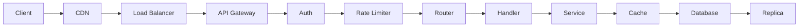
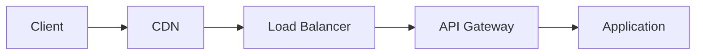
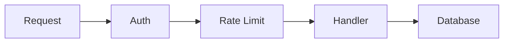
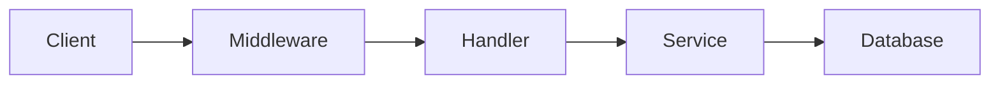
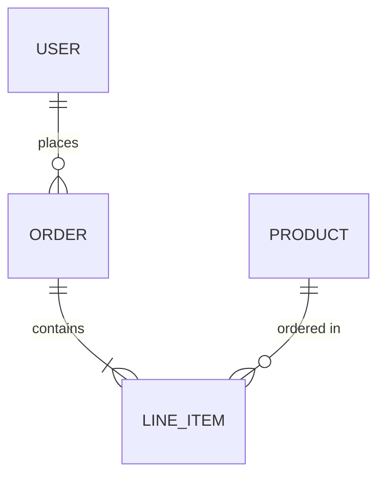
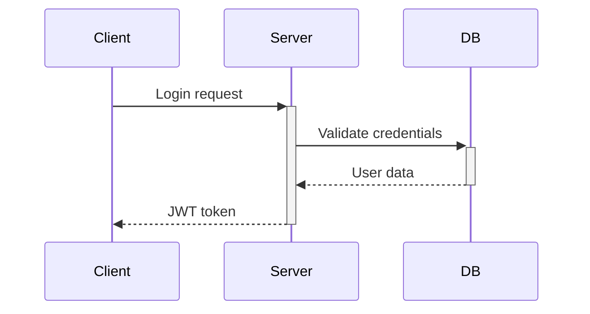

# STORY-024: Define Diagram Guidelines

## Metadata
| Field | Value |
|-------|-------|
| **Status** | ✅ Complete |
| **Story Points** | 2 |
| **Priority** | P2 - Medium |
| **Parent Epic** | EPIC-003 |

---

## User Story
**As a** documentation reader
**I want** clear, helpful diagrams
**So that** I can quickly understand system architecture and flows

---

## Acceptance Criteria

### AC1: Maximum complexity rule
- [ ] Maximum 7 nodes per diagram
- [ ] Split complex diagrams into multiple smaller ones
- [ ] Each diagram has single focus

### AC2: Diagram types per doc type
- [ ] Define which diagram types suit each doc category
- [ ] Provide examples for each type
- [ ] Include when NOT to use diagrams

### AC3: Caption requirements
- [ ] Every diagram has a caption
- [ ] Caption explains what to notice
- [ ] Caption connects diagram to prose

### AC4: Mermaid syntax guidance
- [ ] Standard patterns for common diagrams
- [ ] Consistent styling across diagrams
- [ ] Accessible color choices

---

## Technical Notes

**Diagram Type by Documentation:**

| Doc Type | Recommended Diagrams | Mermaid Type |
|----------|---------------------|--------------|
| Project Overview | 0-1: High-level context | flowchart |
| Architecture | 2-3: System overview, request flow | flowchart, sequence |
| API Reference | 0-1: Request pipeline | flowchart |
| Data Model | 1-2: Entity relationships | erDiagram |
| Auth & Security | 1-2: Auth flow, token lifecycle | sequenceDiagram |
| Component Library | 0: Rarely needed | - |
| Configuration | 0: Not recommended | - |

**7-Node Rule Examples:**

❌ **Too Complex:**


✅ **Split Into Two:**




**Caption Format:**
```markdown
**How requests flow through the system:**

` ` `mermaid
flowchart LR
    A[Client] --> B[API Gateway]
    B --> C[Auth Middleware]
    C --> D[Handler]
    D --> E[Database]
` ` `

Requests pass through authentication before reaching handlers.
The API Gateway handles routing and rate limiting.
```

**Common Patterns:**

**Request Flow:**


**Entity Relationship:**


**Auth Sequence:**


**When NOT to Use Diagrams:**
- Configuration documentation
- Simple CRUD operations
- Single-file utilities
- When prose is clearer

---

## Definition of Done
- [ ] Diagram guidelines added to instructions.md
- [ ] 7-node rule documented with examples
- [ ] Doc type → diagram mapping complete
- [ ] Caption requirements documented
- [ ] Example diagrams for each type
- [ ] Tested with real documentation generation
