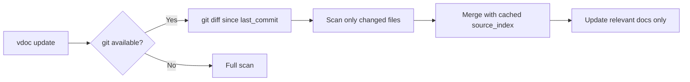
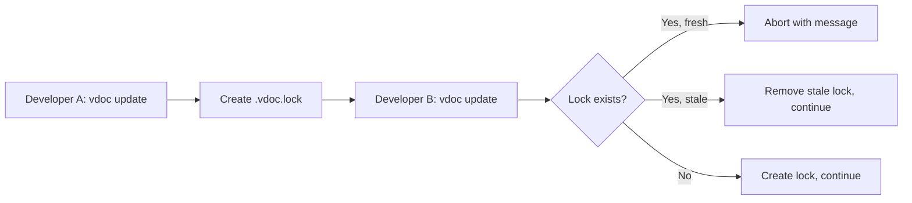

# EPIC-006A: Large Codebase Support

## Metadata
| Field | Value |
|-------|-------|
| **Status** | ✅ Complete (7/7 stories complete) |
| **Ambiguity Score** | 🟡 Medium |
| **Context Source** | Roadmap Phase 4 (split from EPIC-006) |
| **Owner** | TBD |
| **Priority** | P1 - High |
| **Tags** | #performance, #monorepo, #concurrency, #scale |
| **Target Date** | TBD |

---

## 1. The Executive Pitch
> Target Audience: Stakeholders, Business Sponsors, Non-Technical Leads

### 1.1 The Problem
Large codebases (1000+ files) experience slow full scans every time vdoc runs. Multi-language monorepos (TypeScript frontend + Go backend) need composite preset support. Concurrent updates from multiple developers can corrupt the manifest.

### 1.2 The Solution
Implement three capabilities:
1. **Incremental scanning** via git diff (only scan changed files)
2. **Multi-language config** via `vdoc.config.json` (route paths to presets)
3. **Concurrency control** via `.vdoc.lock` (prevent simultaneous updates)

### 1.3 The Value (North Star)
- 10x faster updates on large codebases (scan only changed files)
- Support enterprise monorepos with mixed languages
- Prevent documentation corruption from concurrent edits

---

## 2. The Scope Boundaries (AI Guardrails)
> Target Audience: Planner Agent (Critical for preventing hallucinations)

### 2.1 IN-SCOPE (Build This)
- [ ] Track `last_commit_hash` in `_manifest.json`
- [ ] Detect changed files via `git diff --name-only`
- [ ] Merge incremental scan results with existing `source_index`
- [ ] Define `vdoc.config.json` schema for multi-language projects
- [ ] Load composite presets based on file path matching
- [ ] Create `.vdoc.lock` on update start, check before running
- [ ] Auto-cleanup stale locks older than 10 minutes

### 2.2 OUT-OF-SCOPE (Do NOT Build This)
- No quality metrics or scoring (EPIC-006B)
- No CI/CD integration (EPIC-007)
- No real-time collaboration or distributed locking
- No partial file scanning (always full file hash)

---

## 3. Context

### 3.1 User Personas
| Persona | Need | Pain Point |
|---------|------|------------|
| **Monorepo Maintainer** | Mixed TypeScript + Go codebase | Single preset doesn't work |
| **Enterprise Team** | Multiple developers running vdoc | Manifest corruption |
| **Large Project Dev** | 5000+ file codebase | Full scan takes too long |

### 3.2 User Journey - Incremental Scan


### 3.3 User Journey - Concurrent Update Prevention


### 3.4 Technical Requirements

**Manifest Extension:**
```json
{
  "last_commit_hash": "abc123def456",
  "last_scan_mode": "incremental",
  "scanned_files_count": 47,
  "changed_files_count": 3
}
```

**Multi-Language Config (`vdoc.config.json`):**
```json
{
  "$schema": "./vdoc.config.schema.json",
  "version": "1.0",
  "languages": [
    { "path": "frontend/", "preset": "typescript" },
    { "path": "backend/", "preset": "go" },
    { "path": "scripts/", "preset": "python" }
  ],
  "exclude": ["vendor/", "generated/"]
}
```

**Lock File Format (`.vdoc.lock`):**
```json
{
  "started_at": "2026-02-05T14:30:00Z",
  "pid": 12345,
  "user": "developer@example.com",
  "platform": "cursor"
}
```

---

## 4. Dependencies

### 4.1 Technical Dependencies
- Git (optional, graceful fallback to full scan)
- EPIC-001: manifest system and scan.sh
- EPIC-005: complete preset library

### 4.2 Epic Dependencies
- Blocked by: EPIC-001, EPIC-005
- Blocks: EPIC-006B (quality metrics need manifest), EPIC-007 (CI/CD)

---

## 5. Linked Stories
| Story ID | Name | Status |
|----------|------|--------|
| STORY-050 | Track last scan commit in manifest | ✅ Complete |
| STORY-051 | Implement git diff file detection | ✅ Complete |
| STORY-052 | Merge incremental scan results with cache | ✅ Complete |
| STORY-053 | Create vdoc.config.json schema | ✅ Complete |
| STORY-054 | Implement multi-language preset loading | ✅ Complete |
| STORY-055 | Implement .vdoc.lock creation and checking | ✅ Complete |
| STORY-056 | Add stale lock cleanup (10 min timeout) | ✅ Complete |
