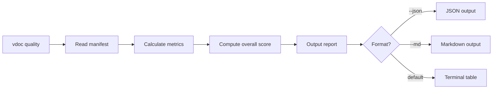

# EPIC-006B: Documentation Quality Metrics

## Metadata
| Field | Value |
|-------|-------|
| **Status** | Complete |
| **Ambiguity Score** | 🟢 Low |
| **Context Source** | Roadmap Phase 4 (split from EPIC-006) |
| **Owner** | TBD |
| **Priority** | P2 - Medium |
| **Tags** | #quality, #metrics, #reporting, #observability |
| **Target Date** | TBD |

---

## 1. The Executive Pitch
> Target Audience: Stakeholders, Business Sponsors, Non-Technical Leads

### 1.1 The Problem
Teams have no visibility into their documentation health. Questions like "What percentage of our code is documented?" and "How stale is our documentation?" have no answers. Engineering managers cannot track documentation debt.

### 1.2 The Solution
Implement a quality scoring system that calculates:
1. **Coverage** - What percentage of source files have documentation
2. **Freshness** - How recently were docs updated relative to code changes
3. **Completeness** - Do doc pages have all required sections filled in

Provide a `vdoc quality` command that outputs a dashboard-style report.

### 1.3 The Value (North Star)
- Quantify documentation health with a single score (0-100)
- Identify documentation gaps before they become problems
- Track improvement over time with historical metrics
- Enable documentation SLAs in engineering teams

---

## 2. The Scope Boundaries (AI Guardrails)
> Target Audience: Planner Agent (Critical for preventing hallucinations)

### 2.1 IN-SCOPE (Build This)
- [x] Calculate coverage: (documented files / total files) * 100
- [x] Calculate freshness: compare doc timestamps to source timestamps
- [x] Calculate completeness: check for empty/missing sections in doc pages
- [x] Compute weighted overall score (0-100)
- [x] Store quality metrics in `_manifest.json`
- [x] Create `vdoc quality` CLI command
- [x] Output formatted report (terminal, JSON, markdown)

### 2.2 OUT-OF-SCOPE (Do NOT Build This)
- No historical tracking / trend graphs (future enhancement)
- No CI/CD integration (EPIC-007)
- No quality gates / fail builds (EPIC-007)
- No per-developer attribution
- No external dashboard or web UI

---

## 3. Context

### 3.1 User Personas
| Persona | Need | Output Format |
|---------|------|---------------|
| **Engineering Manager** | Track team documentation health | Summary report |
| **Tech Lead** | Find gaps before code review | File-level details |
| **Developer** | Know what to document next | Actionable list |

### 3.2 User Journey


### 3.3 Technical Requirements

**Quality Metrics Schema:**
```json
{
  "quality": {
    "overall_score": 78,
    "coverage": {
      "score": 85,
      "documented_files": 42,
      "total_files": 50,
      "undocumented": ["src/utils/helpers.ts", "src/api/legacy.ts"]
    },
    "freshness": {
      "score": 72,
      "avg_days_stale": 14,
      "stale_docs": [
        { "path": "docs/api.md", "days_stale": 45 }
      ]
    },
    "completeness": {
      "score": 80,
      "docs_with_gaps": [
        { "path": "docs/auth.md", "missing": ["examples", "error-handling"] }
      ]
    },
    "computed_at": "2026-02-05T14:30:00Z"
  }
}
```

**Score Weights (Default):**
| Metric | Weight | Rationale |
|--------|--------|-----------|
| Coverage | 40% | Most important - does docs exist? |
| Freshness | 35% | Stale docs can be worse than none |
| Completeness | 25% | Nice to have complete sections |

**Terminal Report Format:**
```
╔══════════════════════════════════════════╗
║       Documentation Quality Report       ║
╠══════════════════════════════════════════╣
║  Overall Score:  78/100  ████████░░      ║
╠══════════════════════════════════════════╣
║  Coverage:       85%     (42/50 files)   ║
║  Freshness:      72%     (14 days avg)   ║
║  Completeness:   80%     (4 docs w/gaps) ║
╚══════════════════════════════════════════╝

Top Issues:
 1. src/utils/helpers.ts - No documentation
 2. docs/api.md - 45 days stale
 3. docs/auth.md - Missing: examples, error-handling
```

---

## 4. Dependencies

### 4.1 Technical Dependencies
- EPIC-001: manifest system with source_index
- EPIC-003: documentation page structure

### 4.2 Epic Dependencies
- Blocked by: EPIC-001, EPIC-003
- Blocks: EPIC-007 (CI quality gates)

---

## 5. Linked Stories
| Story ID | Name | Status |
|----------|------|--------|
| STORY-060 | Implement quality scoring algorithm | Complete |
| STORY-061 | Create vdoc quality CLI command | Complete |
| STORY-062 | Add quality metrics to manifest | Complete |
